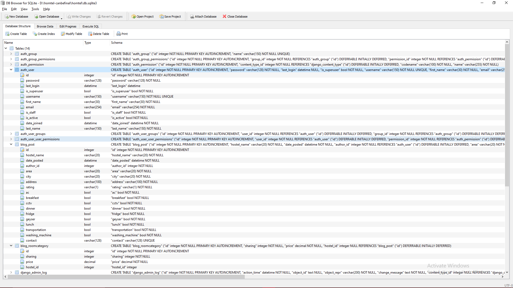

# HOMTEL

As we all know Nirma University faces barriers to provide hostels to students of every department, at the time of admissions students face many problems to find a good hostel nearby. 
We hereby come up with an amazing idea to build a Hostel Information Portal. This Interactive Web application will help students to easily get a hostel of their choice.

## Topic: Hostel Information Portal ( Named : HOMTEL )
By: 

18BCE239 ( Sunidhi Tandel )

18BCE243 ( Tirth A. Patel  )

18BCE244 ( Tirth Hihoriya )

Using this web application customers (students)    can SignUp/ Login as User,  seller(hostel owners)   can  SignUp/ Login. Sellers can add/remove hostels. Corresponding entries will be done in the DATABASE. 
Transaction and security are provided. Search request of the user will generate corresponding queries and fetch info from DATABASE. 

## Features implemented:
#### Update and Delete data of the tables :
1. Register / Login / Update user profile (permission User / Seller)
2. Add /update/delete hostel(permission Seller)
3. Add /update/delete Room category of particular hostel (permission Seller)
#### Apply Data Constraints on Tables    
#### Search and Filter queries :
1. Filter out hostel by hostel name
2. Hostel search by particular Area
3. Hostel search by City
4. Filter out multiple hostels of particular seller(Nested Queries)
5 .Querying in the opposite direction with related objects
6. User/Seller authentication

## Glimpse

## View of Home Page

## Detailed view of hostel

## View of Seller side add hostel / room category

## Search Filters / Queries 

 ## Screenshot of your project's schema

